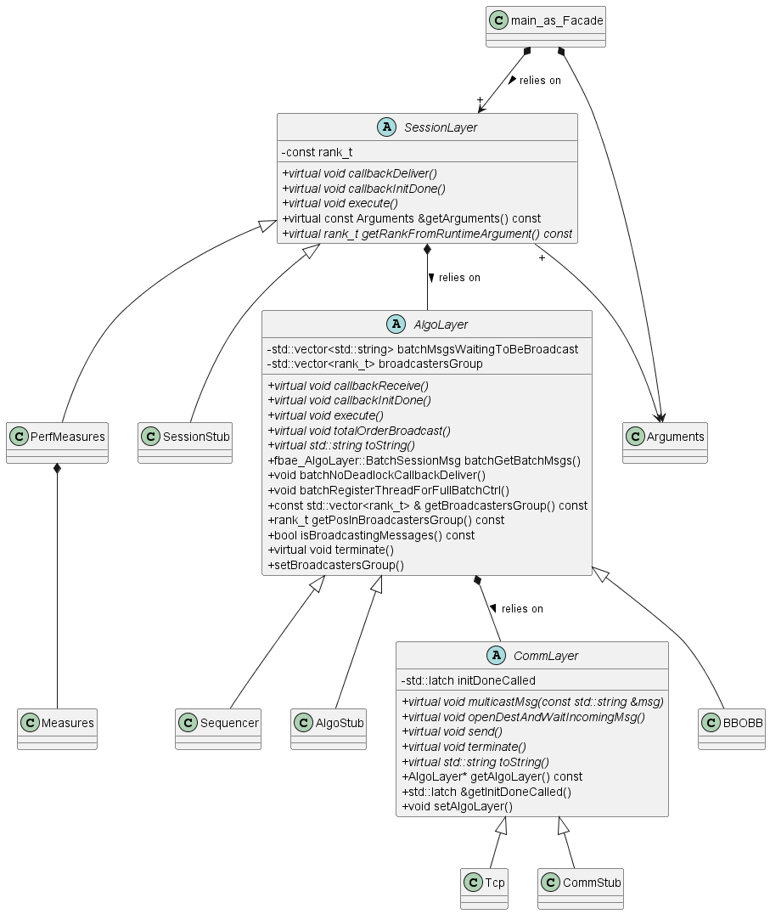
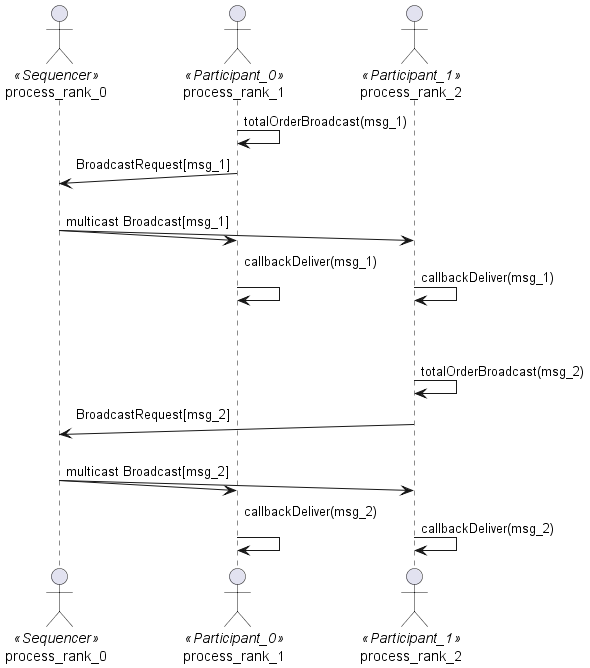
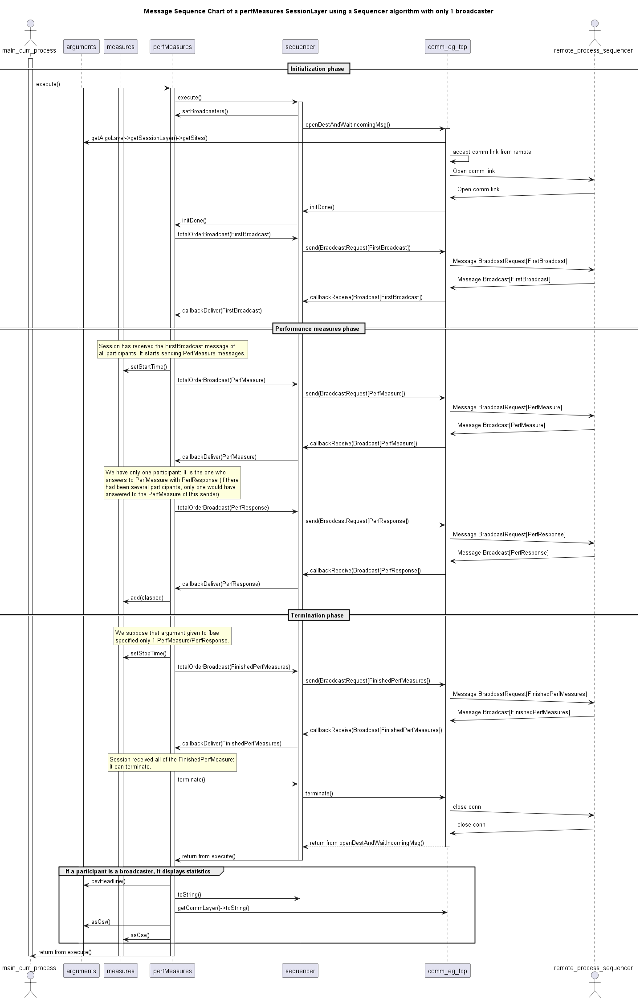
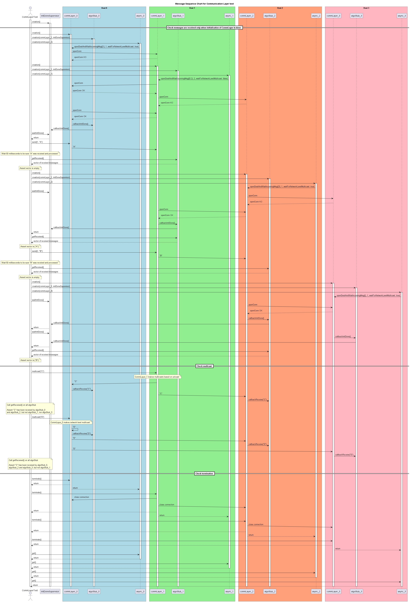

# FBAE Design Document

This document contains design information to help the development of new classes in *FBAE*

## Class diagram

## Sequencer Message Sequence Chart

## Message Sequence Chart of a perfMeasures SessionLayer using a Sequencer algorithm with only 1 broadcaster

## Message Sequence Chart for main test of Tcp communication layer

